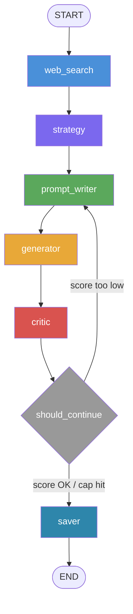

# YouTube Thumbnail Designer — Reflexion Agent

A **LangGraph** agent that designs YouTube thumbnails through iterative self-criticism.  
Hand it a video topic → it searches the web → builds a visual strategy → generates an image → critiques it → loops until the score is good enough → saves the best result.

---

## How it works



### Node breakdown

| Node | What it does |
|------|-------------|
| `web_search` | Tavily search — gathers thumbnail hooks and visual references for the topic |
| `strategy` | **Thumbnail Strategy Agent** — uses structured output (Pydantic) to produce a visual blueprint: subject, emotion, background, style, text overlay, hierarchy |
| `prompt_writer` | Writes (or rewrites) the `gpt-image-1` prompt. On loop iterations, the previous critique is injected so every weakness is addressed |
| `generator` | Calls `gpt-image-1` (1536×1024, 16:9) and saves `iter_N.png` to disk |
| `critic` | Vision LLM (`gpt-4o`) reads the PNG and returns a structured score (1–10) + critique via `with_structured_output` |
| `should_continue` | Conditional edge — loops back to `prompt_writer` if score < target **and** iterations remain; otherwise routes to `saver` |
| `saver` | Picks the highest-rated image, copies it as `final.png`, writes `report.md` |

### Reflexion loop

```
                     ┌─────────────────────────────────────┐
                     │  score < target AND iter < max_iter  │
                     ▼                                      │
prompt_writer → generator → critic ──────────────────────────┘
                                  └──► saver  (score OK or cap hit)
```

The loop is wired as a **conditional edge** (`add_conditional_edges`), satisfying the LangGraph requirement. The `history` field uses `Annotated[list, operator.add]` so every iteration's prompt + image + score is preserved and written into the final report.

---

## Project structure

```
01_langgraph_reflexion/
├── .env                        ← API keys (never committed)
├── .gitignore
├── requirements.txt
├── pyproject.toml
├── README.md
└── thumbnail_agent/
    ├── __init__.py             ← loads .env via python-dotenv
    ├── state.py                ← ThumbnailState TypedDict + history reducer
    ├── prompts.py              ← all prompt strings (strategy, writer, critic)
    ├── tools.py                ← Tavily web search wrapper
    ├── nodes.py                ← 6 node functions + should_continue
    ├── graph.py                ← build_graph() wires nodes + edges
    ├── main.py                 ← CLI entry point
    ├── make_diagram.py         ← writes graph.mmd + graph.png
    └── outputs/                ← (gitignored) run results go here
        └── 20260521_112006_Why_Python.../
            ├── iter_1.png
            ├── iter_2.png
            ├── final.png
            └── report.md
```

---

## Setup

### 1. Prerequisites

- Python 3.11+
- [`uv`](https://docs.astral.sh/uv/) installed

### 2. Clone & create the virtual environment

```bash
git clone https://github.com/alampallysainath8/Langgraph_reflexion_agent.git
cd Langgraph_reflexion_agent

uv venv .venv --python 3.11
```

### 3. Install dependencies

```bash
uv pip install -r requirements.txt --python .venv/Scripts/python.exe
# Windows PowerShell:
uv pip install -r requirements.txt --python .venv\Scripts\python.exe
```

### 4. Add your API keys

Edit `.env` (already in the repo as a template):

```env
OPENAI_API_KEY=sk-proj-...your-key...
TAVILY_API_KEY=tvly-...your-key...
```

> **OpenAI** — needs access to `gpt-4o-mini`, `gpt-4o`, and `gpt-image-1`  
> **Tavily** — free tier is plenty (sign up at [tavily.com](https://tavily.com))

---

## Running the agent

Activate the venv first:

```bash
# Windows
.venv\Scripts\activate

# macOS / Linux
source .venv/bin/activate
```

### Basic run

```bash
python -m thumbnail_agent.main "Why Python is the best language for AI"
```

### Streaming mode (see each node update live)

```bash
python -m thumbnail_agent.main "Why Python is the best language for AI" --stream
```

### Custom thresholds

```bash
# stop at score 7, allow up to 4 iterations
python -m thumbnail_agent.main "10x Productivity with VS Code" --target 7 --max-iter 4
```

### Generate the graph diagram

```bash
python -m thumbnail_agent.make_diagram
# writes thumbnail_agent/graph.mmd  and  thumbnail_agent/graph.png
```

---

## Output

Each run creates a timestamped folder under `thumbnail_agent/outputs/`:

```
outputs/20260521_112006_Why_Python_is_the_best_language/
├── iter_1.png      ← first generated thumbnail
├── iter_2.png      ← second attempt (if loop fired)
├── final.png       ← copy of the highest-rated image
└── report.md       ← full history: strategy, prompts, scores, critiques
```

### Sample `report.md` excerpt

```markdown
# YouTube Thumbnail — Why Python is the best language for AI

**Best rating**: 8/10  |  **Total iterations**: 2  |  **Target**: 8/10

## Iteration 1  —  Score: 6/10
**Prompt used:**
> A focused Python developer at a futuristic desk...

**Critique:**  The text overlay is too small and blends into the background.
The focal subject lacks emotional intensity...

## Iteration 2  —  Score: 8/10
...

## Final (best iteration)
Score **8/10** — iteration 2
```

---

## Architecture decisions

| Decision | Reason |
|----------|--------|
| `ThumbnailState(TypedDict, total=False)` | Keys are optional at construction — nodes only write what they produce |
| `history: Annotated[list, operator.add]` | LangGraph's append reducer keeps all iterations; default would overwrite |
| `with_structured_output(ThumbnailStrategy)` | Guarantees the strategy fields are always present and typed |
| `with_structured_output(CritiqueOutput)` | Guarantees `rating` is always an `int` — conditional edge logic depends on it |
| `graph.compile()` plain (no checkpointer) | Keeps it simple; checkpointers are not required for this assignment |
| `gpt-image-1` at `1536×1024` | OpenAI's current image model; `dall-e-3` is deprecated on project-scoped keys |

---

## Environment variables reference

| Variable | Required | Description |
|----------|----------|-------------|
| `OPENAI_API_KEY` | Yes | OpenAI project API key |
| `TAVILY_API_KEY` | Yes | Tavily search API key |
