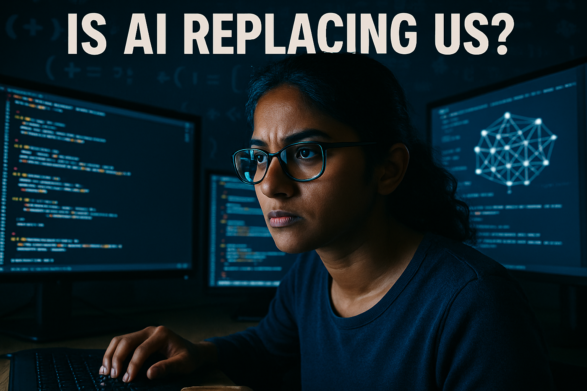

# YouTube Thumbnail — IS AI REPLACING SOFTWARE ENGINEERS?

**Best rating**: 8/10  |  **Total iterations**: 1  |  **Target**: 8/10

---

## Research Summary

- AI-Powered YouTube Thumbnail Tips for Developer Channels: AI Replaced 80% of Coding — Master These 7 Skills Instead. The 2025 data shows something unexpected: AI has not replaced software engineers.
- Tips to Optimize YouTube Thumbnails with AI: # Tips to Optimize YouTube Thumbnails with AI. When people browse YouTube, the first thing they see is your thumbnail. A thumbnail is like a cover of your video, and if your thumbnail does not attract
- This is Why AI Could Replace Programmers - YouTube: This is Why AI Could Replace Programmers. 49K views · 1 month ago ... Best Practices in .NET I Don't Like Anymore. Nick Chapsas. New. 45K
- Make viral YouTube thumbnails using AI without wasting time – Gyre: Hacks to Make Viral YouTube Thumbnails with AI in 2026. AI-generated thumbnails have become one of the most powerful growth accelerators for YouTube creators in 2026. More than 80% of creators already
- What do you think of YouTube incorporating AI-generated ... - Quora: Before you add a thumbnail the most important thing is you have enabled the custom thumbnail option from the youtube creator studio. · Once that

---

## Iteration History

### Iteration 1  —  Score: 8/10

**Prompt used:**
> A close-up of a focused software engineer sitting at a sleek, modern desk, surrounded by multiple screens displaying code and AI algorithms. The engineer, a young South Asian woman with glasses, is illuminated by the bright glow of the screens, casting dramatic shadows. The lighting is high-contrast with a cool blue and white color temperature coming from the screens, contrasting against a darker background filled with abstract coding symbols. The mood is intense and forward-looking. At the top, bold text overlay reads “Is AI Replacing Us?” in white, with a subtle drop shadow for emphasis.

**Critique:**  The thumbnail effectively uses bold, readable text that immediately captures attention with the question "IS AI REPLACING US?" The focal point is clear, with the intense expression of the person in front of multiple screens, which adds an emotional hook and curiosity about the topic. The color contrast is decent, though it could be improved by adding more vibrant elements to make it pop. Overall, the production quality is high, and the image successfully conveys the theme of AI and its impact on software engineers.

---

## Final (best iteration)

Score **8/10** — iteration 1

