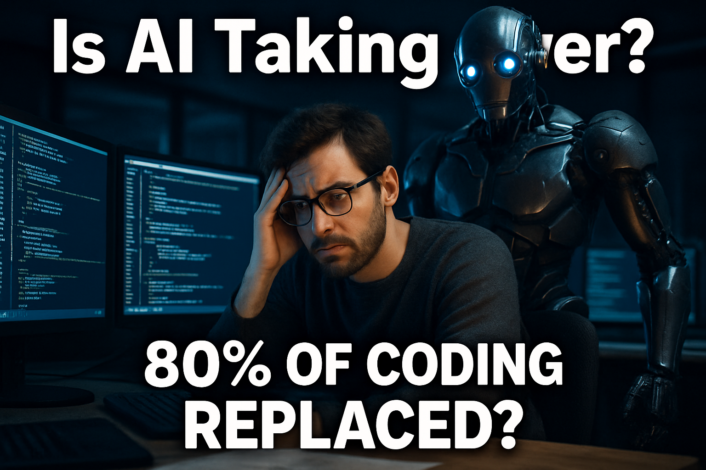

# YouTube Thumbnail — IS AI REPLACING SOFTWARE ENGINEERS?

**Best rating**: 8/10  |  **Total iterations**: 1  |  **Target**: 8/10

---

## Research Summary

- AI-Powered YouTube Thumbnail Tips for Developer Channels: AI Replaced 80% of Coding — Master These 7 Skills Instead. The 2025 data shows something unexpected: AI has not replaced software engineers.
- Tips to Optimize YouTube Thumbnails with AI: # Tips to Optimize YouTube Thumbnails with AI. When people browse YouTube, the first thing they see is your thumbnail. A thumbnail is like a cover of your video, and if your thumbnail does not attract
- This is Why AI Could Replace Programmers - YouTube: This is Why AI Could Replace Programmers. 49K views · 1 month ago ... Best Practices in .NET I Don't Like Anymore. Nick Chapsas. New. 45K
- Make viral YouTube thumbnails using AI without wasting time – Gyre: Hacks to Make Viral YouTube Thumbnails with AI in 2026. AI-generated thumbnails have become one of the most powerful growth accelerators for YouTube creators in 2026. More than 80% of creators already
- What do you think of YouTube incorporating AI-generated ... - Quora: Before you add a thumbnail the most important thing is you have enabled the custom thumbnail option from the youtube creator studio. · Once that

---

## Iteration History

### Iteration 1  —  Score: 8/10

**Prompt used:**
> A worried software engineer sits at a cluttered desk in a dimly lit tech office, with the glow of multiple coding screens illuminating his anxious expression. Behind him, a large AI robot looms ominously, its metallic surface glinting in the dramatic, high-contrast lighting coming from the screens, which cast a cool blue hue. The camera angle is slightly low, emphasizing the engineer's concern while capturing the imposing presence of the robot. At the top of the thumbnail, bold white text reads "Is AI Taking Over?" with a secondary hook at the bottom stating "80% of coding replaced?" to drive curiosity.

**Critique:**  The thumbnail effectively uses bold, readable text that clearly communicates the topic and creates a curiosity gap with phrases like "80% OF CODING REPLACED?" The focal point is strong, featuring a concerned individual with a robot looming behind, which visually represents the theme of AI replacing jobs. The color contrast is good, with the blue glow of the robot's eyes adding a pop of color. The emotional hook is compelling, as it taps into the fear of job displacement. Overall, the production quality is high, but slightly more contrast or a brighter highlight could enhance the text's visibility further.

---

## Final (best iteration)

Score **8/10** — iteration 1

